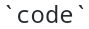
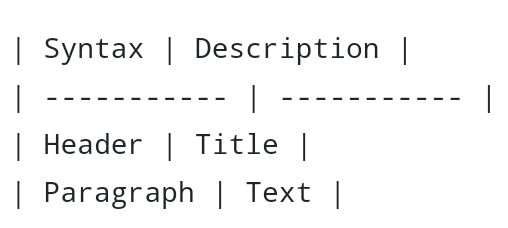
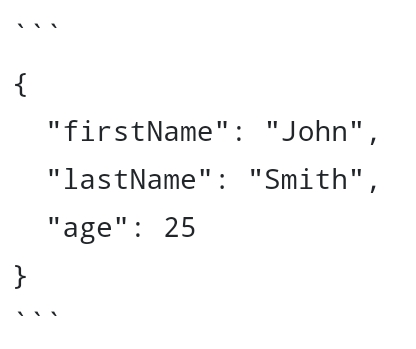

# Markdown Cheat Sheet

## Basic Syntax

|Element|Markdown Syntax|
|-------|---------------|
|Heading|`# h1` <br> `## h2` <br> `### h3`|
|Bold|`**bold text**`|
|Italic|`*italic text*`|
|Blockquote|`> blockquote`|
|Ordered list|`1. First item` <br> `2. Second item` <br> `3. Third item`|
|Unordered list|`- First item` <br> `- Second item` <br> `- Third item`|
|Code||
|Horizontal rule|`---`|
|Link|`[profile](https://github.com/tanzilamd)`|
|Image|``|

## Extended Syntax
|Element|Markdown Syntax|
|-------|---------------|
|Table||
|Heading ID|`### My Great Heading` <br> `{#custom-id}`|
|Fenced Code Block||
|Task List|`- [x] Write the press release` <br> `- [ ] Update the website` <br> `- [ ] Contact the media`|
|Strikethrough|`~~The world is flat.~~`|


### Heading

# H1
## H2
### H3

### Bold

**bold text**

### Italic

*italicized text*

### Blockquote

> blockquote

### Ordered List

1. First item
2. Second item
3. Third item

### Unordered List

- First item
- Second item
- Third item

### Code

`code`

### Horizontal Rule

---

### Link

[title](https://www.example.com)

### Image


## Extended Syntax

These elements extend the basic syntax by adding additional features. Not all Markdown applications support these elements.

### Table

| Syntax | Description |
| ----------- | ----------- |
| Header | Title |
| Paragraph | Text |

### Fenced Code Block

```
{
  "firstName": "John",
  "lastName": "Smith",
  "age": 25
}
```

### Footnote

Here's a sentence with a footnote. [^1]

[^1]: This is the footnote.

### Heading ID

My Great Heading {#custom-id}

### Definition List

term
: definition

### Strikethrough

~~The world is flat.~~

### Task List

- [x] Write the press release
- [ ] Update the website
- [ ] Contact the media

references :https://www.markdownguide.org/
